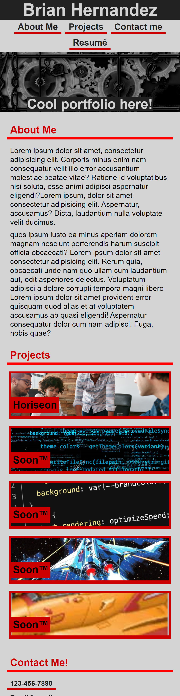

# My-Portfolio

## Description

Hello!
  This is the first iteration of my personal portfolio where I will house the projects I've worked on as well as my contact information and background.
I built this page in order to begin establishing myself as a developer, and gain understanding of what goes into an effective portfolio. This is actually
my first professional portfolio of any kind, so I'm excited to finally have one! Building it myself was really fun and informative, too. I've learned 
how to build a web application from scratch, and use different forms and methods of styling to achieve a layout based on a reference image, without any 
code to use as a guide.

# [Click here to go to my portfolio!](https://hdezbriant.github.io/My-Portfolio/)
### (Currently only optimized for mobile, desktop version coming soon!™)

## Credits

Big thanks to:\
[Christian Payan](https://github.com/chrispayan),\
[Tyler Abegg](https://github.com/UnDuhDuhSea),\
Arvin John Bautista, and\
Andrew Parsons\
\
for all their help and for staying up to help each other out!\
You guys are awesome :)
